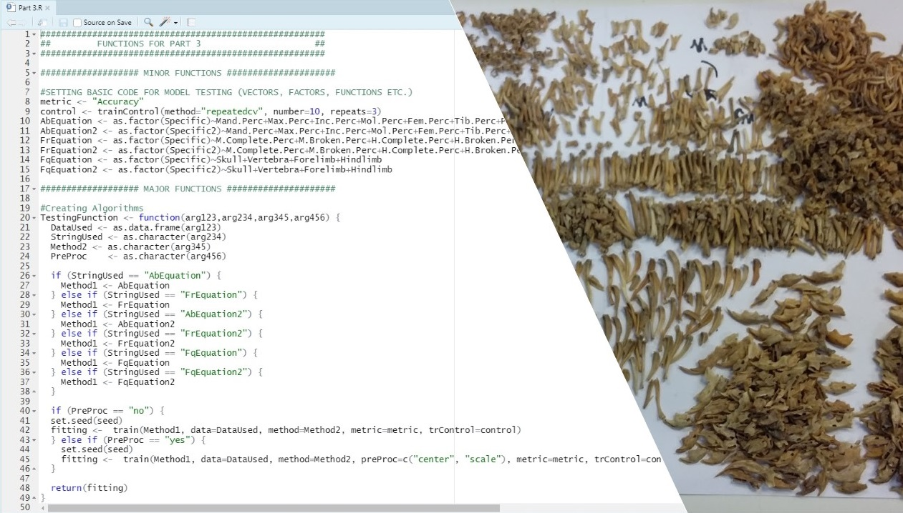
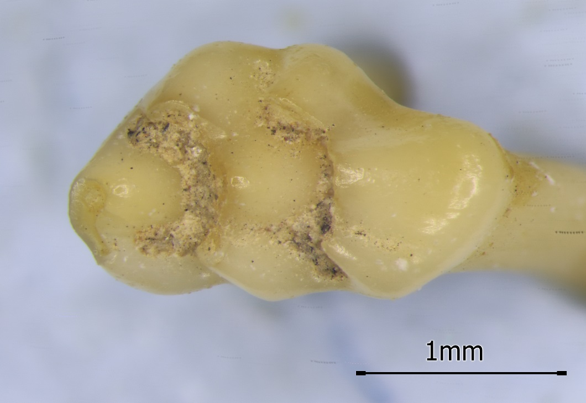

# 🐭GENERAL PROFILE
---

Self-driven and passionate about his work, I am a published PhD graduate with a background in micromammal archaeology and academic teaching (statistics and statistical programming). I hope to either continue my academic career, combining archaeology and evolutionary biology to investigate human impact on both domesticated and wild species evolution or find a place where my broad range of skills may be of use.

[Email](mailto:andrzej.romaniuk@ed.ac.uk) / [LinkedIn](https://www.linkedin.com/in/andrzej-aleksander-romaniuk-74145292/) / [ORCID](https://orcid.org/0000-0002-4977-9241) / [Researchgate](https://www.researchgate.net/profile/Andrzej-Romaniuk)

# 💻SKILLS
---

**Key Skills**
-	**Software:**          MS Office (Word, Excel, PowerPoint, Outlook), OpenRefine, MeshLab, SPSS, TeX (MiKTeX)
-	**Programming:**       R (RStudio), SQL (SQLite), Python (IDLE/Jupyter)
-	**Languages:**         Polish (native), English (fluent - C2), Spanish (communicative - A2)
-	**Organisation:**      conducting literature review and research, research assistance, event preparation, curation of teaching, research and 
museum collections, writing and publishing research papers, HR & financial administration (research/teaching projects)
-	**Teaching:**          preparation/supervision of lab exercises, workshops, practical examinations and
                     open labs, supporting learning, creating necessary teaching aids (e.g. handouts)
-	**Technology-related:**  documenting and hosting a coding project, usage of regular expressions, statistical programming, basics of machine 
learning and app creation in R, 3d scanning with EinScan light scanners, using Github for handling open projects

**Accreditation**
-	**Languages:**        English, Certificate of Proficiency in English
-	**Teaching:**          Advance HE, associate ; The Carpentries, certified Data Carpentries instructor
-	**Digital:**           University of Edinburgh, Developing Your Data Skills 2020-2021
-	**Driving:**           driving license (Pol/EU)

# 🔬EDUCATION
---

**Doctor of Philosophy (PhD)** in Archaeology, [University of Edinburgh](https://www.ed.ac.uk/history-classics-archaeology), UK  
*September 2017 – February 2022*  
See NMS blog entry on the research [HERE](https://blog.nms.ac.uk/2018/04/04/of-voles-and-men/) and Twitter post 
[HERE](https://twitter.com/NatSciNMS/status/935119929292009472)  
See Orkney Museum blog entries [HERE](https://orkneymuseum.wordpress.com/2022/07/22/why-where-and-how-investigating-small-mammals-remains/) and 
[HERE](https://orkneymuseum.wordpress.com/2022/07/22/why-where-and-how-investigating-small-mammals-remains-2/)  
Side project on coprolites (fossilized faeces) published [HERE](https://doi.org/10.1007/s12520-020-01225-9)  
Viva voce on 5th October 2021, thesis available online [HERE](https://era.ed.ac.uk/handle/1842/38704)  

**Master in Science (MSc)** in Osteoarchaeology, [University of Edinburgh](https://www.ed.ac.uk/history-classics-archaeology), UK  
*September 2014 – August 2015*  
Thesis results published [HERE](http://rsos.royalsocietypublishing.org/content/3/10/160514)  

**Bachelor of Arts (BA)/Master of Arts (MA)** in Archaeology, [University of Warsaw](https://www.archeologia.uw.edu.pl/en/new-main-page/), PL  
*October 2008 – September 2013*  

# 🔨EXPERIENCE
---

## WORKPLACE (since 2013)

**DUSC Data Carpentry Coordinator**, [EPCC, University of Edinburgh](https://www.epcc.ed.ac.uk/), UK  
*December 2023 (till April 2025)* 
Originally overseeing multiple aspects of self-hosted data carpentries workshops, such as instructor and helper recruitment, workshop preparation, hosting and marketing, handling communications between workshop staff, participants and host institution (EPCC), including personal and finacial data. Additonally, teaching specific parts of the workshop in person. From June 2024 a project manager for the Software Sustainability Institute dissemination project, see the details [HERE](https://www.software.ac.uk/research-software-practices-social-sciences).   

**Postdoctoral Research Fellow**, [IASH, University of Edinburgh](https://www.iash.ed.ac.uk/), UK  
*September 2022 - June (Funding End)/ August (Research Project End) 2023* 
Related to IASH HCA fellowship, awarded June 2022. Project proposal revolves around the usage of geometric-morphometric analytical methods on archaeological material, and the comparison of the results with modern samples. See below, one of the first images obtained from the archaeological samples. Publication currently in preparation.

   

**Helper (2021)/Instructor (2022-3)**, [Edinburgh Carpentries](https://edcarp.github.io/), UK 
*April 2021 / April-June 2022 / March-December 2023 *  
During data carpentry sessions, organised by Edinburgh Carpentries as a part of the Data Skills Workforce Development programme (2021-2) and later Data Upskilling Short Courses (2023). See workshops pages [HERE](https://edcarp.github.io/2021-4-20-sfc-dc/) and [HERE](https://edcarp.github.io/2021-4-26-sfc-dc/) for 2021 season, [HERE](https://edcarp.github.io/2022-04-12-wfd-dc-online/) and [HERE](https://edcarp.github.io/2022-06-07-wfd-dc-online/) for 2022 season, [HERE](https://edcarp.github.io/2023-03-07-dusc-dc-online/), [HERE](https://edcarp.github.io/2023-04-04-dusc-dc-online/), [HERE](https://edcarp.github.io/2023-05-09-dusc-dc-online/), [HERE](https://edcarp.github.io/2023-06-06-dusc-dc/), [HERE](https://edcarp.github.io/2023-09-12-dusc-dc-online/), [HERE](https://edcarp.github.io/2023-10-10-dusc-dc-r-online/) and [HERE](https://edcarp.github.io/2023-12-05-dusc-r-regex-sql-online/) for 2023 season.   

**Qualified Exhibition Supervisor**, [Museum of Warsaw](https://muzeumwarszawy.pl/en/), PL  
*May 2022 - July 2022* 
3 months placement. Required tasks included necessary preparations for the musuem to open or close, superivison of the museum exhibition during opening hours, working with other staff (curators and technical team) to ensure museum exhibitions safety, and engagement with the visitors.   

**Research/Teaching assistant**, [University of Edinburgh](https://www.ed.ac.uk/history-classics-archaeology), UK  
*May 2020 – October 2021* 
Several contract or internal (contractless) work for the [School of History Classics and Archaeology](https://www.ed.ac.uk/history-classics-archaeology) (HCA) and [Centre for Data, Culture and Society](https://www.cdcs.ed.ac.uk/) (CDCS). Major included: 
-	Curatorial work for the [National Museums of Scotland Natural Sciences](https://www.nms.ac.uk/collections-research/collections-departments/natural-sciences/) department (creating a database of red squirrel Sciurus vulgaris skeletal specimens, measurements and pathological changes recording, supporting related research)
-	Literature reviews/pilot work for two pilot projects related to brucellosis and leprosy in animals, under the supervision of [Dr Robin Bendrey](https://www.ed.ac.uk/history-classics-archaeology/about-us/staff-profiles/profile_academic.php?search=2&uun=rbendrey)
-	Preparation of a tutorial on creating simple web applications for CDCS (see [HERE](https://doi.org/10.5281/zenodo.5705151), full citation in the Published Teaching Materials CV section)  

**Lab Demonstrator**, [HCA, University of Edinburgh](https://www.ed.ac.uk/history-classics-archaeology), UK  
*September 2017 – August 2020*   
As a part of the School Doctoral Scholarship. Supported teaching by helping in or leading exercise sessions/open labs for both undergraduate and postgraduate courses, as well as by curating teaching collection of both animal and human skeletal remains. Worked with course organisers, [Dr Linda Fibiger](https://www.ed.ac.uk/history-classics-archaeology/about-us/staff-profiles/profile_tab1_academic.php?uun=lfibiger) and [Dr Kathleen McSweeney](https://www.ed.ac.uk/history-classics-archaeology/about-us/staff-profiles/profile_academic.php?search=8&uun=kmcsween). Main courses included:    
-	[Human Musculo-Skeletal Anatomy](http://www.drps.ed.ac.uk/15-16/dpt/cxpghc11367.htm)
-	[Analytical Methods in Human Osteology](http://www.drps.ed.ac.uk/16-17/dpt/cxpghc11230.htm)
-	[Skeletal Pathology](http://www-test.drps.ed.ac.uk/16-17/dpt/cxpghc11231.htm)
-	[The Human Skeleton in Archaeology and Forensic Science](http://www.drps.ed.ac.uk/20-21/dpt/cxarca08014.htm)   

**Night shift receptionist/Reservations team member**, [IBIS Warszawa Centrum](https://all.accor.com/hotel/2894/index.pl.shtml) - Warsaw, PL   
*October 2016 – May 2017*    
Initially responsible for front-desk services for hotel guests, handling individual reservations and end-of-day documentation, including cash register settlement. Later moved to handle long-term corporate/group reservations.  

**Quality Assurance tester**, [Proper QA](https://www.properqa.com/) – Edinburgh, UK   
*September 2015 – February 2016*  
Tester for mobile applications, responsible for testing and documenting found issues in a dedicated application (JIRA).   

**Junior office assistant internship**, [Microsystem Group](https://gb.kompass.com/c/microsystem-group-andrzej-synejko-i-joanna-synejko-sp-j/pl080693/) – Warsaw, PL  
*March – September 2013*  
Responsible for collecting documentation for tender offers.   

## VOLOUNTARY (since 2013)

**Instructor**, [CAA Poland](https://pl.caa-international.org/), PL  
*June 2022*  
Delivered a self-designed workshop on how to design simple applications in R during the [Forum GIS UW 2022](https://pl.caa-international.org/caa-polska-forum-gis-uw-2022/) conference. Official workshop page available [HERE](https://pl.caa-international.org/2022/06/09/caa2022-data-science-projektowanie-aplikacji-shiny/?fbclid=IwAR1KVkgOmwrorUQ1l5X1TWxPvQ_PIePzv0C_o9LKeX-oTZY3RLG5YLPwtuI), with Github repository available [HERE](https://github.com/AndrzejRomaniuk/ShinySamouczek).  

**Helper/Instructor**, [Edinburgh Carpentries](https://edcarp.github.io/), UK  
*March 2019 – March 2020*  
For several Data Carpentry workshops organised by Edinburgh Carpentries (See example workshops [HERE](https://edcarp.github.io/2019-02-18-edinburgh-business-school/) and [HERE](https://edcarp.github.io/2019-05-06-edinburgh/)).  

**Organising committee member**, [University of Edinburgh](https://www.ed.ac.uk/history-classics-archaeology), UK  
*December 2017*  
Organising committee member during the AEA Autumn conference 2017 (See conference abstract [HERE](https://www.ed.ac.uk/files/atoms/files/aea_conference_final_programme.pdf)).   

**Volunteer/Research associate**, [National Museums of Scotland](https://www.nms.ac.uk/collections-research/collections-departments/natural-sciences/), UK  
*April 2015 – February 2022*  
At the Natural Sciences department. Related to vertebrate collection and MSc/PhD work.   

## OTHER

**Team member**, [University of Warsaw](https://www.archeologia.uw.edu.pl/en/new-main-page/), PL & [Peking University](http://archaeology.pku.edu.cn/), CN   
*August 2008 – August 2013*  
From a practicant and international exchange to a team specialist on various archaeological missions. List of major archaeological sites:  
-	Poland (*Tłuste*, Roman influences period settlement; *Brudnice*, Roman influences period cemetery; *Szurpiły*, early Medieval fortified settlement)
-	Crimea (*Sevastopol*, Greek colonization period farms; *Balaklava*, Roman military camp)
-	Turkmenistan (*Serahs* oasis, Sassanid-Early Islamic fort)
-	Lebanon (*Porphyreion* [*Jiyeh*], late Roman-Bizantine settlement)
-	Bulgaria (*Novae*, Roman military camp)
-	China (*Dongpin*, early Han – late Tang city; *Shuang-an*, late Neolithic to early Shang cemetery)   

# 📖PUBLICATIONS (in English)
---

## PEER-REVIEWED

**Romaniuk, AA, Renaud, S, Bendrey, R, Searle, J, Owen, O, & J Herman 2024** Insular evolution from an archaeological perspective: a case study of Orkney house mouse. Biological Journal of The Linnean Society **advance article** DOI: [https://doi.org/10.1093/biolinnean/blae005](https://doi.org/10.1093/biolinnean/blae005)

**Romaniuk, AA, Troalen, LG, Bendrey, R, Herman, JS, Owen, O & C Smith 2023** Pests or Prey? Micromammal species within an ancient anthropic environment at the Norse settlement site of Tuquoy (Westray, Orkney). Royal Society Open Science 10 (4) DOI: [https://royalsocietypublishing.org/doi/10.1098/rsos.221462](https://royalsocietypublishing.org/doi/10.1098/rsos.221462)

**Romaniuk, AA, Panciroli, E, Buckley, M, Pal Chowdhury, M, Willars, C, Herman, JS, Troalen, L, Shepherd, AN, Clarke, DV, Sheridan, AS, van Dongen, BE, Butler, IB & R Bendrey 2020.** Combined visual and biochemical analyses confirm depositor and diet for Neolithic coprolites from Skara Brae. Journal of Archaeological and Anthropological Sciences 12 (274) DOI: [https://doi.org/10.1007/s12520-020-01225-9](https://doi.org/10.1007/s12520-020-01225-9)

**Romaniuk, AA, Shepherd, AN, Clarke, DV, Sheridan, AJ, Fraser, S, Bartosiewicz L & JS Herman 2016.** Rodents: food or pests in Neolithic Orkney. Royal Society Open Science 3 (10) DOI: [https://doi.org/10.1098/rsos.160514](https://doi.org/10.1098/rsos.160514)

  
## TEACHING MATERIALS
  
**Romaniuk, A 2021.** Building interactive web applications in R using SHINY. Zenodo DOI: [https://doi.org/10.5281/zenodo.5705151](https://doi.org/10.5281/zenodo.5705151)

# 📖OTHER WRITTEN WORK
---

## STUDENT PUBLICATIONS (in Polish)

**Romaniuk, AA 2013.** Kulty greckie na terenie Baktrii w okresie istnienia królestwa Greków
Baktryjskich. In J. Hamburg ed. Szkice z Archeologii Bliskiego i Środkowego Wschodu: Tom II. Warsaw, PL: SKN ASBW „Szarkun”.

**Romaniuk, AA 2012.** Slonie na Bliskim Wschodzie w Okresie Hellenistycznym. In W.Ejsmond & A.Romaniuk
eds. Szkice z Archeologii Bliskiego i Środkowego Wschodu. Warsaw, PL: SKN ASBW „Szarkun”.

## UNPUBLISHED TEACHING MATERIALS

**Romaniuk, A 2022.** Projektowanie prostych aplikacji w R przy uzyciu SHINY. Translation of Romaniuk, A. 2021 into Polish. GitHub: [https://github.com/AndrzejRomaniuk/ShinySamouczek](https://github.com/AndrzejRomaniuk/ShinySamouczek)
